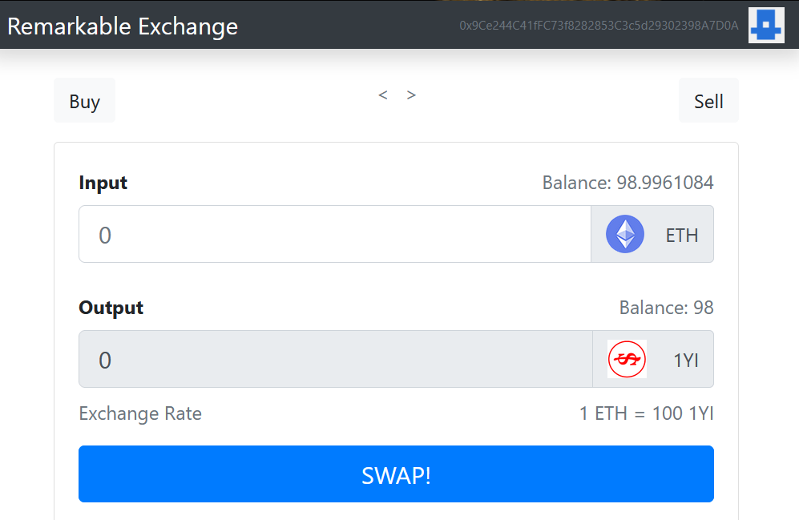

# ENHANCED DEX

`PT7210027 Mark Tan, SGBT4`

### DEPENDENCIES

- [Node.js](https://nodejs.org)
- [Ganache](https://www.trufflesuite.com/ganache)
- Truffle `npm install -g truffle@5.1.14` to install
- [Metamask](https://chrome.google.com/webstore/detail/metamask/nkbihfbeogaeaoehlefnkodbefgpgknn?hl=en)

### GETTING STARTED

>Clone this repo

>Run [Ganache](https://www.trufflesuite.com/ganache)

>Open [Metamask](https://metamask.io/) and set the RPC to 7545

```
local host: http://localhost:7545
chain ID: 1337
```
>Create an account in Metakmask using the private key of the first account in Ganache 

>Run the dependencies

```
git clone ...
cd ...
npm install
npm install --save identicon.js@^2.3.3
```

>Run the test
```
truffle test
```
>Migrate the files and run the frontend at the [localhost](http://localhost:3000)

>Create a secrets.json file on the root directory with the paramaters below and then add the file to .gitignore

```
{
    "mnemonic": "markvelous remarkable ether ...",
    "projectId": "API KEY"
}
```

>Deploy the app on Rinkeby (adjust the _timeoutBlocks_ in truffle-config.js if you have a slow network connection)
```
truffle migrate --network rinkeby
npm run start
```
